# Study runtime boundary

The study path engine remains unchanged. `Study.flow` and
`Profile/Guest.studiesInfo.path` continue to control branching, retakes,
resume behavior, and progression. A flow node identifies a Task; only the
resolved Task selects its runtime.

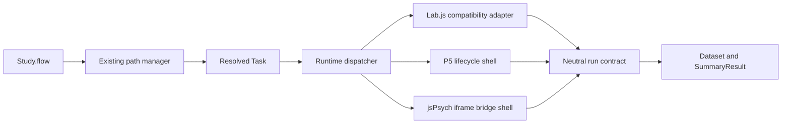

P5 and jsPsych currently mount non-executing shells. Only Lab.js
(`isSavingData`) calls `startRun` and persists a Dataset.

## Layers

Reusable code lives on runtime assets. A Task binds one asset, plus semantic
type, parameters, and settings. Study flow still only places that Task.

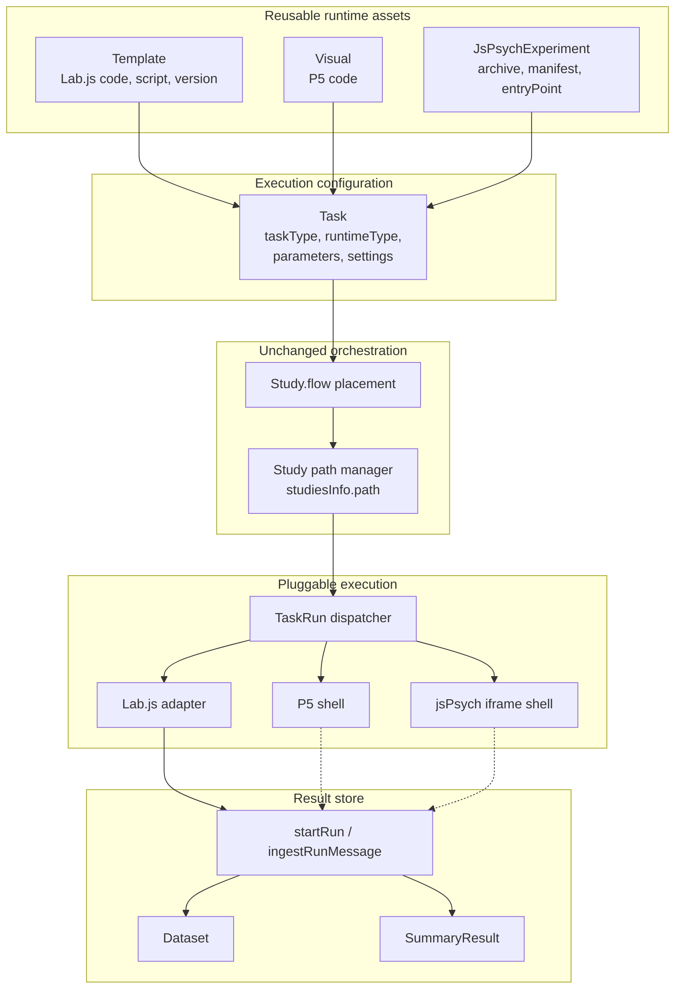

Dashed persistence edges are the intended contract. They are not wired for
production P5 or jsPsych execution yet.

## Study flow graph

Flow-node shape is unchanged. Runtime metadata is not stored on the node.

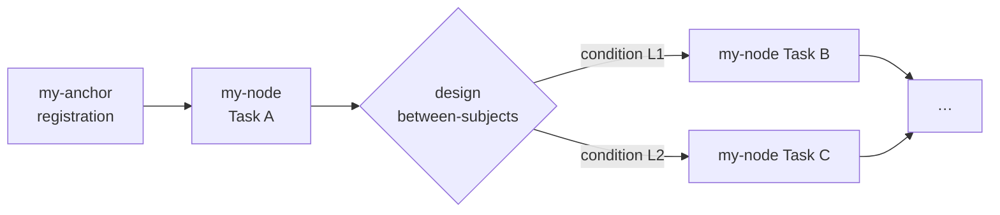

Each `my-node` carries `componentID` (Task id) and `testId`. The dispatcher
loads that Task and reads `runtimeType` plus the matching asset relationship.

## Ownership

`Task.taskType` remains semantic (`TASK`, `SURVEY`, or `BLOCK`).
`Task.runtimeType` selects `LABJS`, `P5`, or `JSPSYCH`.

- LABJS uses `Task.template`.
- P5 uses `Task.visual`.
- JSPSYCH uses `Task.jsPsychExperiment`.

Exactly one matching relationship is required. Runtime assets own reusable
code/package metadata, publication/privacy, parameter definitions,
documentation, version, and asset authorship. Tasks own concrete parameter
values, runtime settings, aggregate-variable configuration, and Task
authorship. Dataset and SummaryResult associations for both authors are
looked up on the server.

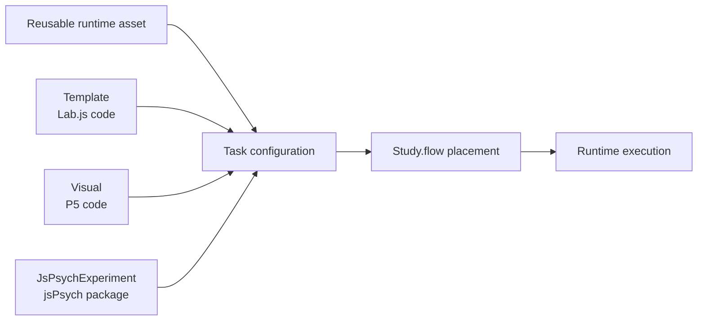

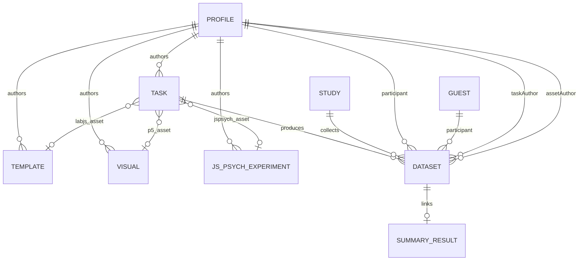

`JsPsychExperiment` stores a versioned archive, manifest, and entry point.
The first runtime only establishes a same-origin iframe handshake; it does not
extract or execute the archive.

## Participate sequence

Join still writes `studiesInfo.path`. The Manager still advances that path.
The leaf executor is now `TaskRun`, which issues a server run before Lab.js
mounts.

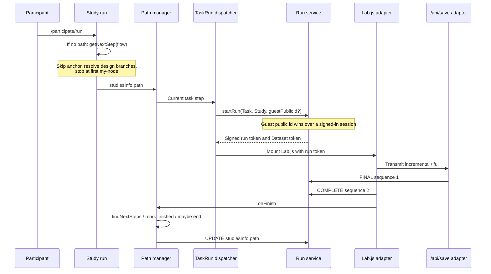

## Lifecycle and persistence

`startRun` validates study membership and Task configuration, derives the
participant, study, test/study versions, runtime asset, and both authors, then
creates a Dataset and returns a signed, expiring run token.

If `guestPublicId` is provided, the run is always a GUEST participant, even
when a researcher session cookie is present.

Messages use the following runtime-neutral operations:

1. `BATCH` appends incremental rows.
2. `FINAL` stores final rows and the runtime-computed aggregate.
3. `COMPLETE` marks the Dataset complete. It is rejected until a `FINAL`
   exists.
4. `FAILURE` records a runtime failure.

Every message carries a strictly increasing sequence. Repeated sequence
numbers receive an idempotent acknowledgement; gaps are rejected.

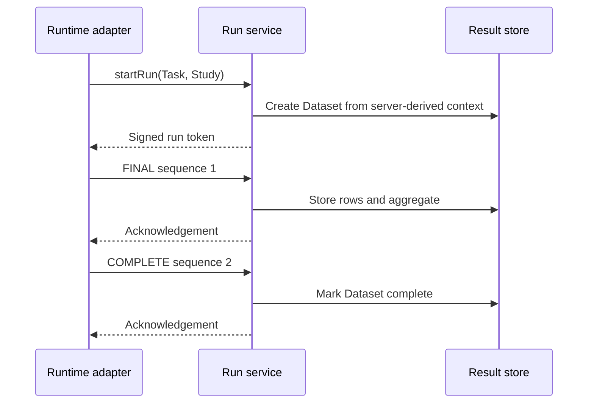

### Lab.js compatibility adapter

The Lab.js Transmit plugin still posts to `/api/save`. That route now acts as
the compatibility adapter: it requires the run token, writes filesystem JSON
under the server Dataset token, preserves row-embedded `aggregated` behavior,
then translates `payload === "full"` to `FINAL`. `COMPLETE` is sent by the
Lab.js runner after Transmit, not by `/api/save`. Collection joins continue to
use the existing Dataset and SummaryResult relationships.

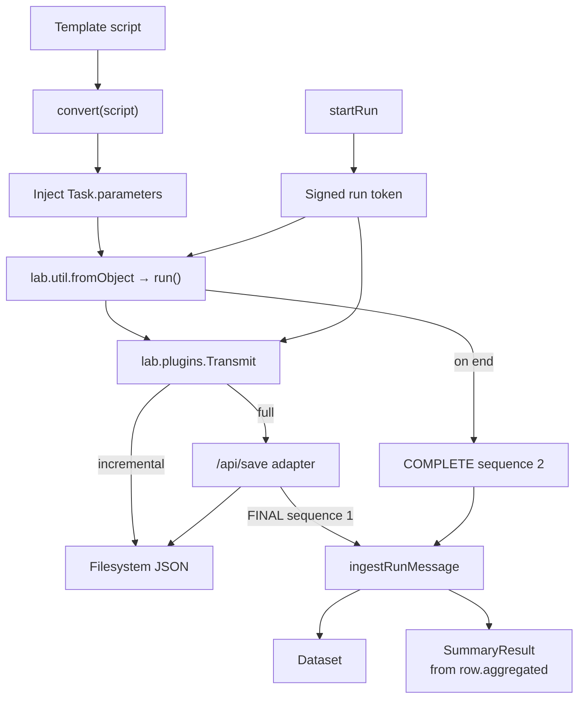

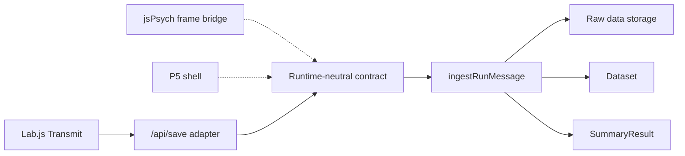

The server stores the aggregate the runtime supplies. It does not compute
experiment summaries from raw trials. `Task.settings.aggregateVariables` is
catalog/UI metadata only.

## Collection and Data Tool

Completed Datasets appear in Test & Collect. Data Journal study datasources
load `SummaryResult` rows whose matching Dataset is marked `isIncluded`.
If none are included, the Data Tool shows an empty-state message instead of
an empty grid.

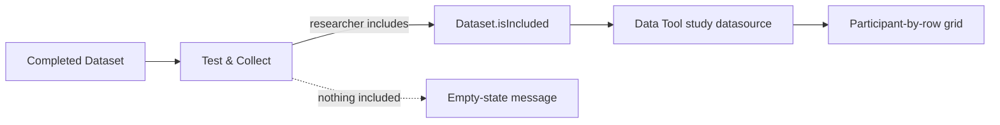

## Security boundary

Clients never choose participant, author, asset, or result associations.
Dataset and SummaryResult direct creation is closed; run mutations use the
verified token and server-derived context. Result reads and updates are
limited to the participant, Task/asset authors, study author/collaborators,
and administrators. Guest token possession supports the existing anonymous
completion and data-policy flow.

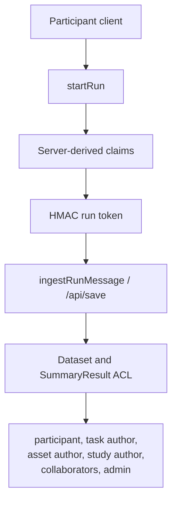

## Deferred

Production P5 and jsPsych execution, archive extraction/building, Four-in-a-
Row migration, Firebase replacement, runtime authoring banks, GitHub import,
a separate runtime origin, broader raw-download hardening, and mixed-runtime
execution tests remain out of scope.
