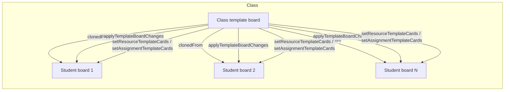
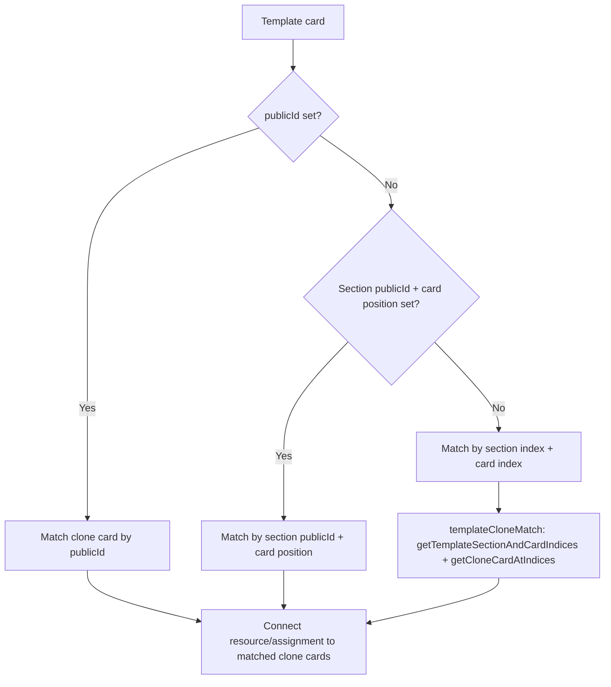
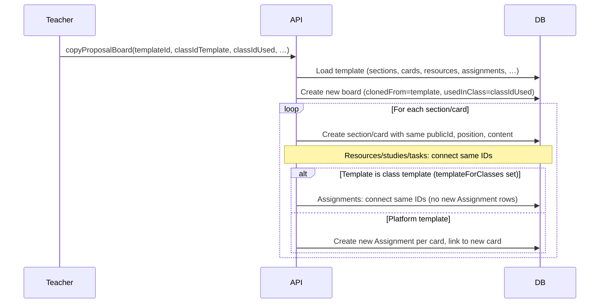
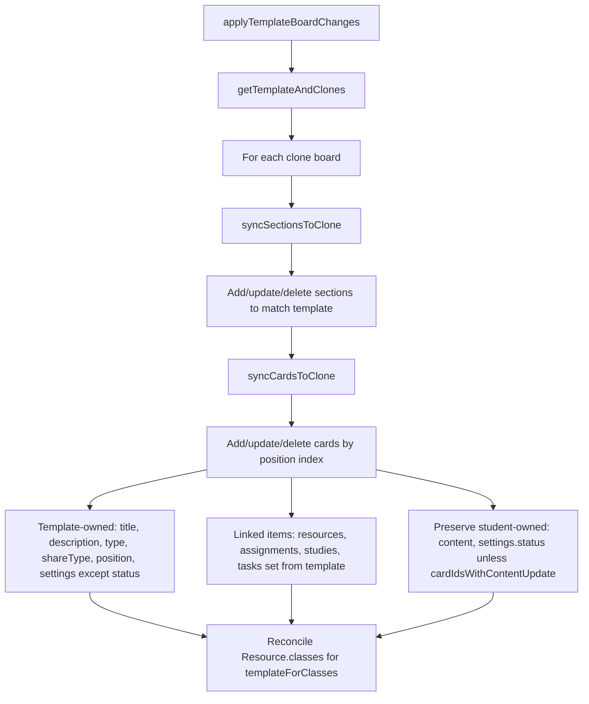
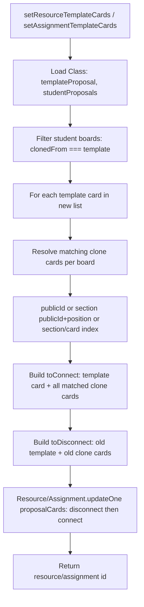

# Assignment, Resources & Board Propagation to Student Templates

**Summary:** When a **Class** uses a proposal board as its **class template**, that board is the single source of truth. All **student boards** are clones of it (`clonedFrom` = template). Changes to the template’s structure, content, and linked assignments/resources are propagated to every student board so students see a consistent, up-to-date layout with the same links.

---

## 1. Data model

```mermaid
erDiagram
  Class ||--o| ProposalBoard : "templateProposal"
  Class ||--o{ ProposalBoard : "studentProposals"
  ProposalBoard ||--o| ProposalBoard : "clonedFrom"
  ProposalBoard ||--o{ ProposalBoard : "prototypeFor"
  ProposalBoard ||--o{ ProposalSection : "sections"
  ProposalSection ||--o{ ProposalCard : "cards"
  ProposalCard }o--o{ Resource : "resources"
  ProposalCard }o--o{ Assignment : "assignments"

  Class {
    string id
    string title
  }
  ProposalBoard {
    string id
    templateForClasses "class template if non-empty; isTemplate is platform-only"
  }
  ProposalCard {
    string id
    string publicId
    int position
  }
```

- **Class**
  - **templateProposal**: The one proposal board used as the class template.
  - **studentProposals**: All proposal boards “used in” that class (one per student; each is a clone of the template).
- **ProposalBoard**
  - **clonedFrom**: For a student board, the template board it was copied from.
  - **templateForClasses**: For a class template board, the class(es) that use it as their template. A board is treated as a **class template** when this list is non-empty (not via `isTemplate`, which is reserved for platform-wide templates).
- **ProposalCard**
  - Can link to **Resource** and **Assignment** via many-to-many. Propagation keeps these links in sync between template cards and the corresponding clone cards.

---

## 2. When propagation runs

Propagation happens in three situations:

| Trigger | Mutation / flow | What gets propagated |
|--------|----------------------------------|------------------------|
| Teacher sets class template and students get boards | `copyProposalBoard` | Full clone: sections, cards, **same** resource/assignment IDs on clone cards. |
| Teacher edits template (sections/cards/content) | `applyTemplateBoardChanges` | Section/card structure and template-owned fields to all clones; **Resource.classes** updated for classes using this board. |
| Teacher links/unlinks resources or assignments to template cards | `setResourceTemplateCards`, `setAssignmentTemplateCards`, `linkAssignmentToTemplateCard`, `unlinkAssignmentFromTemplateCards` | Which cards the resource/assignment is linked to on the template and on **all** student boards. |

---

## 3. End-to-end flow (high level)



- **Template** is the single source; **student boards** are identified by `clonedFrom.id === templateBoardId`.
- **applyTemplateBoardChanges** syncs structure and template-owned fields (and reconciles Resource.classes).
- **setResourceTemplateCards** / **setAssignmentTemplateCards** (and link/unlink mutations) sync which cards a resource/assignment is linked to on the template and on every clone.

---

## 4. Clone card matching (template card → student card)

When we propagate **links** (resource or assignment) from a template card to student boards, we must find the **same** card on each clone. Matching uses this priority:



- **1. publicId**  
  If the template card has `publicId`, the clone card with the same `publicId` on that student board is used.
- **2. Section publicId + card position**  
  If not, we use `section.publicId` and `card.position` to find the same section and same position on the clone.
- **3. Section index + card index**  
  If publicIds are missing, we use **ordered** sections and cards (by `position`). We get the template card’s (sectionIndex, cardIndex) and use the clone card at the same indices (`templateCloneMatch.ts`). This avoids wrong matches when multiple cards share the same position value.

Same logic is used for:
- Linking (set resource/assignment to template card → connect to matched clone cards).
- Unlinking (disconnect from old template card → disconnect from matched clone cards).

---

## 5. copyProposalBoard (initial student board)

When a student gets their board by copying the class template:



- **Resources / studies / tasks:** Clone cards are connected to the **same** resource/study/task IDs as the template (shared across class).
- **Assignments:** If the template is a **class template** (`templateForClasses` set), clone cards reuse the **same** assignment IDs. Otherwise (e.g. platform template), new assignments are created and linked to the new cards.

---

## 6. applyTemplateBoardChanges (template structure/content)

When the teacher edits the template and we push to all clones:



- **Sections:** Created, updated (title, description, position, publicId), or removed so clone sections match template order and content.
- **Cards:** Matched by **position index** within each section. For each template card we either update the clone card at that index or create/delete so counts and order match.
- **Template-owned:** Title, description, type, shareType, position, settings (except `status`) and **linked items** (resources, assignments, studies, tasks) are **set from the template** on the clone card.
- **Student-owned:** Content and `settings.status` are kept on existing clone cards unless the template card is in `cardIdsWithContentUpdate` (teacher explicitly updated that card’s content).
- **Resource.classes:** After syncing, any resource linked on the template is connected to every class in `template.templateForClasses` so the class’s resource list stays in sync.

---

## 7. setResourceTemplateCards / setAssignmentTemplateCards (link propagation)

When the teacher chooses which template cards a **resource** or **assignment** is linked to (e.g. from the class Resources UI):



- **Input:** `resourceId` or `assignmentId`, `templateCardIds` (ids of template cards to link to), `classId`.
- **Scope:** Only cards on the class template board and on boards that are `studentProposals` for that class and `clonedFrom` that template.
- **Connect:** Template card IDs plus every matched clone card (same publicId or section+position or indices) across all those student boards.
- **Disconnect:** Previous template and clone cards that are no longer in the new set (including when the teacher unlinks from a card).
- **setResourceTemplateCards** with empty `templateCardIds` = unlink from all cards on the class template and its clones.

---

## 8. Key files

| Area | File |
|------|------|
| Clone card matching (indices) | `keystone/mutations/utils/templateCloneMatch.ts` |
| Template → clones sync (sections/cards) | `keystone/mutations/utils/boardPropagation.ts` |
| Apply template edits to all clones + Resource.classes | `keystone/mutations/applyTemplateBoardChanges.ts` |
| Copy board (initial student board) | `keystone/mutations/copyProposalBoard.ts` |
| Link resource to template cards + propagate | `keystone/mutations/setResourceTemplateCards.ts` |
| Link assignment to template cards + propagate | `keystone/mutations/setAssignmentTemplateCards.ts` |
| Link one assignment to one template card + propagate | `keystone/mutations/linkAssignmentToTemplateCard.ts` |
| Unlink assignment from all template/clone cards | `keystone/mutations/unlinkAssignmentFromTemplateCards.ts` |

---

## 9. Strategy in one sentence

**The class template board is the single source of truth; student boards are clones. We propagate structure and content via `applyTemplateBoardChanges` (using position-based section/card matching), and propagate resource/assignment links via dedicated mutations that find the corresponding clone cards by publicId, section+position, or section/card index, then update the resource/assignment’s `proposalCards` on both template and all clones.**
